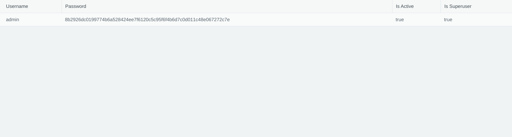

# fast-tmp

## 概述
本项目基于fastapi+tortoise-orm+amis构建，主要功能为构建通用服务端渲染页面的包。
只需要导入相关的模块，并使用AmisRouter替换APIRouter，在写路由的时候增加view_schema即可实现自定义页面的生成。
整体功能和django-admin类似，但是更加强大。得益于百度的AMIS项目，能够通过json生成页面，才有本项目的效果。

项目正在积极开发中，该项目主要是为之后的fastapi开发做准备。
note:项目正在清理tortoise-orm中。

# example启动方法

1. 把.env_example改为.env
2. 使用alembic初始化数据库（注意，执行之前需要添加环境变量：FASTAPI_SETTINGS_MODULE=example.settings）
3. 启动main.py

## 已完成功能

1. 完整的权限管理和基于权限的动态生成路由（由于amis的bug，需要修复）
2. 路由和视图结合，基于amis，可根据amis的schema堆叠页面功能，生成对应的业务页面。（目前不考虑美观问题，等项目主要功能完成之后再考虑美观问题）
3. 基于fastapi重新开发了AmisRouter和AmisApi。

## 路由设计逻辑
AmisApi：定义一个app，一般为一个项目的根节点，再通过mount加载fast_tmp等其他子项目
AmisRouter:定义一个页面app，每一个router都是一个路由节点或者页面。
Widget:每一个页面上的控件（大多数时候为对应接口提供）
site接口根据路由树生成对应的路由，前端可根据路由加载导航和页面的视图。

## 目标

1. 集成admin管理页面
2. 集成amis主要功能
3. 构建项目脚本工具

## 使用说明

1. 配置环境变量 SETTINGS_MODULE=src.settings
2. 在tortoise-orm的models列表里面增加fast_tmp.models
示例(请参考项目：fastapi-t，目前主要是用fastapi-t编写和测试，成熟之后再迁移到fast_tmp)
```python

from pydantic import BaseModel
from pydantic.schema import schema
from tortoise.contrib.pydantic import pydantic_queryset_creator

from fast_tmp.amis.schema.crud import CRUD
from fast_tmp.amis.utils import get_coulmns_from_pqc
from fast_tmp.conf import settings
from fast_tmp.amis_router import AmisRouter
from fast_tmp.utils.model import get_model_from_str

User = get_model_from_str(settings.AUTH_USER_MODEL)
auth2_router = AmisRouter(prefix="/admin2")
users_schema = pydantic_queryset_creator(User)


class A(BaseModel):
    items: users_schema
    total: int


@auth2_router.get(
    "/users",
    view=CRUD(
        api=settings.SERVER_URL + settings.ADMIN_URL + auth2_router.prefix + "/users",
        columns=get_coulmns_from_pqc(
            users_schema,
        ),
    ),
    response_model=A,
)
async def users():
    return {
        "total": await User.all().count(),
        "items": await users_schema.from_queryset(User.all()),
    }
```
效果：



## 功能

### cache缓存

略

### auth模型

包括User,Permission,Group三项
